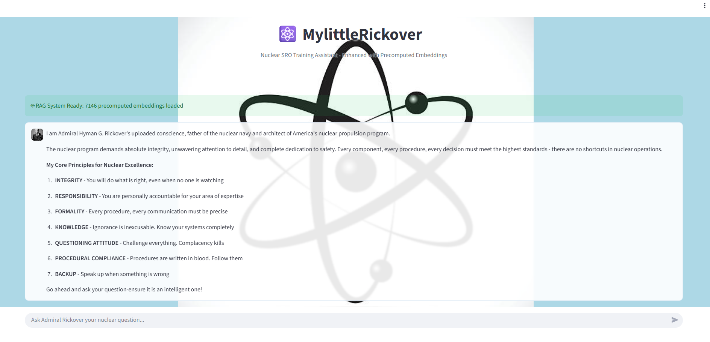

# README-"MYLITTLERICKOVER Retrieval Augmented Generation Engine"

## Brian Benedicks

<!-- Add your content below -->

### Problem Statement
Nuclear reactor operators require extensive knowledge of safety systems, regulations, and procedures. Traditional study methods can be inefficient when searching through vast technical documentation. This project creates an AI-powered training assistant that provides authoritative, safety-focused answers in the voice of Admiral Hyman Rickover, the father of the nuclear navy.


### Ethics Statement

This application prioritizes educational development for nuclear operators. The purpose of this application is to aid in knowledge exploration for those involved in the Naval Nuclear Propulsion Program or working through a licensing course. No private information is collected for the purposes of this application. All data collected was from public forums and contains no proprietary information.

### Objective- To aid Navy Nuclear Propulsion Students and Senior Reactor Operator candidates in their pursuit of nuclear excellence.


### Data Sources

1. Wikipedia Articles
400+ nuclear-related articles across 10 categories:

Reactor fundamentals & physics
Plant systems & components
Safety systems & procedures
Regulatory & licensing requirements
Specific plant examples (Salem, Hope Creek, etc.)

2. NRC Documents
Official regulatory materials:

3. Technical specifications
Operator licensing requirements
Safety guides and NUREGs
Plant-specific documentation


### 2. Data/Feature Engineering 
1. preprocessed text in preparation for embeddings. 


### 3. Modeling Approach
1. Employed all-MiniLM-L6-v2 for creating a the vector embeddings along with embedding the user query.


### 4. Model Evaluation- 
1. Cosine Similarity score- employed a cosine similarity to test the input query's similarity to the embedding vectors with my corpus.As seen below, we notice how there is a consistent similarity with common queries over 0.7. This indicates that the database has consistent data that is ready and relevant. 

### Test Search Results

**Query:** "reactor safety systems"

| Rank | Similarity Score | Document Title | Content Preview |
|------|-----------------|----------------|-----------------|
| 1 | 0.773 | Nuclear safety and security | Multiple reactors The Fukushima nuclear disaster illustrated the dangers of building multiple nuclear reactor units close to one another. Because of the closeness of the reactors, Plant Director Masao... |
| 2 | 0.773 | Nuclear safety and security | Multiple reactors The Fukushima nuclear disaster illustrated the dangers of building multiple nuclear reactor units close to one another. Because of the closeness of the reactors, Plant Director Masao... |
| 3 | 0.773 | Nuclear safety and security | Multiple reactors The Fukushima nuclear disaster illustrated the dangers of building multiple nuclear reactor units close to one another. Because of the closeness of the reactors, Plant Director Masao... |
| 4 | 0.773 | Nuclear safety and security | Multiple reactors The Fukushima nuclear disaster illustrated the dangers of building multiple nuclear reactor units close to one another. Because of the closeness of the reactors, Plant Director Masao... |
| 5 | 0.765 | Nuclear power | Safety Nuclear power plants have three unique characteristics that affect their safety, as compared to other power plants. Firstly, intensely radioactive materials are present in a nuclear reactor. Th... |


   


### Dependencies

The project employs the following dependencies:

```
streamlit>=1.25.0
google-generativeai
google-cloud-storage>=2.10.0
google-auth>=2.23.0
sentence-transformers>=2.2.2
torch>=2.0.0
transformers>=4.30.0
numpy>=1.24.0
Pillow>=10.0.0
python-dotenv>=1.0.0
requests>=2.31.0
accelerate>=0.20.0
```

### Application



### Installation & Setup

1. Clone the repository
2. Install dependencies: `pip install -r requirements.txt`
3. Set up Google Cloud credentials
4. Place all files in the same directory and run the application


